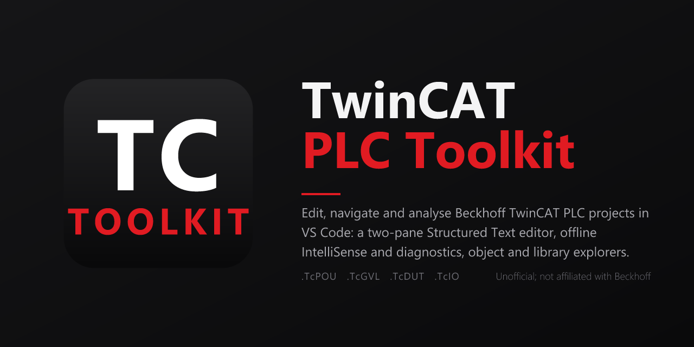

# TwinCAT PLC Toolkit



A lightweight, offline VS Code extension for editing, navigating and analysing Beckhoff **TwinCAT**
PLC projects (`.TcPOU`, `.TcGVL`, `.TcDUT`, `.TcIO`). It hides the XML wrappers behind a two-pane
editor, adds **Structured Text (IEC 61131-3)** language support from a built-in language server, and
gives you explorers for the project's objects and its libraries.

TwinCAT stores PLC code as XML, with the actual Structured Text buried inside `<![CDATA[ ... ]]>`
blocks. This extension parses that XML, presents the declaration and implementation in two editor
panes, and writes your edits back into the original CDATA — preserving TwinCAT's file structure and
metadata (`LineIds`, folders, UUIDs), so TwinCAT and version control never see spurious diffs.

Everything runs locally. No internet connection, no TwinCAT installation and no external toolchain
are required.

---

## Features

### Two-pane editor

Opens `.TcPOU` / `.TcGVL` / `.TcDUT` / `.TcIO` with the Declaration (variables) on top and the
Implementation below, separated by a resizable splitter. No raw XML.

### TwinCAT Objects explorer

Browse POUs, interfaces, GVLs, DUTs and their methods, properties, actions and virtual folders.
Create and delete files, folders, methods, properties and actions — the nearest `.plcproj` is kept in
sync automatically. The tree follows you: switching editors reveals and highlights the matching item.

**See the real TwinCAT hierarchy.** When the opened folder contains TwinCAT solutions, the explorer
shows the solution first and every PLC project belonging to it underneath:

```text
EOL                         Solution (.sln)
└─ HPR40_EOL                PLC project (.plcproj)
   ├─ GVLs
   ├─ POUs
   └─ DUTs
```

A solution can contain any number of PLC projects, and a workspace can contain several solutions.
Same-named solutions are given the shortest parent-folder suffix needed to distinguish them, while
PLC-project names are compared only with siblings in their own solution. A `.plcproj` not referenced
by a solution remains available as a top-level project. If there is no TwinCAT solution, the explorer
keeps the existing project/folder view. Go to Definition and Find References expand this complete
chain and highlight the exact method, property, accessor, action or transition that was opened.

**Every kind carries its own icon**, so the tree is readable at a glance: function blocks, programs
and functions are told apart rather than sharing one file icon, a DUT shows whether it is a
structure, an enumeration, a union or an alias, and methods, properties, property accessors, actions
and transitions each have their own glyph. Hover a row to see its kind spelled out.

**Reorganise by drag & drop.** Drag a method, property or action into one of its POU's virtual
folders — or onto the file node to move it back to the root. The edit is a single `FolderPath`
attribute on the member's tag, and folder tags are placed exactly where TwinCAT expects them, so
XAE loads the result cleanly. Drag files or whole folders into other folders and the `.plcproj`
is re-synced automatically. Incompatible drops simply do nothing: a component never leaves its
file, a folder cannot be dropped into its own subtree, and a name collision at the destination is
refused rather than overwritten.

**Duplicate by copy/paste.** Right-click → **Copy** / **Paste**, or **Ctrl+C** / **Ctrl+V** while
the view is focused. Where a drag *moves*, a paste *duplicates* — so a copied method may be pasted
into **another** function block (interface members only into interfaces), pasting onto a component
drops the copy beside it in the same virtual folder, and a name clash prompts with a ready
`Name_Copy` suggestion. Pasting a copied *file* always asks for the new object's name, then rewrites
everything that carries its identity — the root name, the declaration header, the `LineIds`, and
every internal Id GUID — so the duplicate never collides with its source in TwinCAT.

**Insert your own objects into the code.** Right-click a POU, interface, GVL, DUT or one of its
members → **Insert at Cursor** to drop its bare name into the pane you were last editing, or
**Insert Definition at Cursor** (POUs and members) to get a ready-to-fill call with the object's
real parameter list, laid out and typed exactly like the Libraries view does it:

```
fbGripper(
    bExecute := ,  // BOOL
    nId      := ,  // UDINT
    bDone    => ,  // BOOL
);
```

A function block inserts a derived **instance** name (`FB_Gripper` → `fbGripper`), because ST calls
an instance and never the type — replace it with your own. Functions and programs insert under their
own name, and a method or action inserts bare, since the instance to call it on is whatever you
already have.

**Rename anything, reference-aware.** Right-click → **Rename**, or **F2** while the view is focused.
Files, methods, properties, actions, transitions, disk folders and virtual folders can all be
renamed in place — the XML identity (tag name, declaration header, `LineIds`) and the `.plcproj`
follow automatically, and internal Ids are kept so TwinCAT sees a rename, not a new object. If the
symbol is referenced in code, a dialog offers the choice: **rename only**, or **rename and update
every reference** across the project — call sites, instance declarations and qualified uses alike,
**including the references that live outside the code**: symbol paths in visualizations
(`.TcVIS`/`.TcVMO`), dynamic-text entries in text lists (`.TcTLO`/`.TcGTLO`), and the POU a task
calls (`.TcTTO`) — so the project keeps building. Updates are applied conservatively: a path is only
rewritten when it provably resolves to the renamed symbol through the project's types, a task's POU
call is only rewritten when it names that exact object (never a library POU like
`VisuElems.Visu_Prg`), and any occurrence that cannot be matched exactly is skipped and reported
rather than guessed at.

### TwinCAT Libraries explorer

Lists every library referenced by the project's `.plcproj` **by the namespace you actually type in
code**. That matters, because the three names a library carries often differ — TwinCAT's recipe
library is `RecipeManagement` in the project file, `Recipe Management` by title, but
`Recipe_Management` in ST — so the namespace is the row label and the title, version and company are
the description.

Expand a library and its types are grouped by kind — **Function Blocks**, **Functions**,
**Interfaces**, **Structures**, **Enumerations**, **GVLs**, **Data Types** — each with a count, since
a library can carry hundreds of types. Expand a type to see its fields and its **methods**, each with
its signature; expand a method to see its parameters. Grouping is read from the library's own data
rather than guessed from name prefixes, so a type is filed by what it *is* — `E_DriveDynamicParameter`
is not an enumeration, whatever its name suggests.

Right-click a row for:

- **Insert at Cursor** — drops the namespace (or the qualified type name, or a method name) into the
  pane you were last editing and opens the suggest list.
- **Insert Definition at Cursor** — for a function block, function or method, inserts a ready-to-fill
  call with its whole parameter list laid out and typed (inputs bind with `:=`, outputs with `=>`):
  ```
  Tc2_Standard.TON(
      IN := ,  // BOOL
      PT := ,  // TIME
      Q  => ,  // BOOL
      ET =>   // TIME
  );
  ```
- **Copy Namespace** / **Copy Qualified Name**.

The view re-indexes itself when the `.plcproj` changes, so a library added in TwinCAT appears without
a reload.

### Update Library Definitions

> ### ⚠️ Requires a TwinCAT XAE installation
>
> This is the **one** feature that is not offline. It drives your installed TwinCAT once to export
> data that exists nowhere else on disk. On a machine without TwinCAT the command says so and changes
> nothing — everything else in the extension keeps working.

The toolbar button at the top of the Libraries view enriches what the toolkit knows about your
libraries: **function parameter and return signatures, the inputs/outputs of function blocks your
project has not used yet, and global constants** — none of which can be read from the library files
themselves. Only TwinCAT can export them, so this one command drives your installed TwinCAT once to
dump them into a `library-signatures.xml` in the workspace, which the extension then indexes offline.

It asks **which XAE Shell to use, 32-bit or 64-bit**, every time. That is not a formality: a library's
signatures can differ between the two — visualisation libraries especially — so pick the one your
project is built with. If you always use the same one, set `twincat.libraryDefinitions.shell` and the
prompt goes away.

If your project pins a library version that the chosen shell does not have installed, the closest
installed version of the same major release is used instead, rather than dropping the library.

It drives its **own** shell instance and leaves any you already have open alone, including their
unsaved work. It briefly opens a TwinCAT window while it runs (about a minute).

### Structured Text language support

- **Code completion** is context-aware: it offers only what is legal at the caret, so `x : ▮` gets
  types and library namespaces (not `END_IF`), `x := ▮` gets values, and a call's parentheses get its
  parameters first. It covers local and method variables, POU members, GVL globals, DUT struct fields,
  enum members, dotted member access (`fb.member`, including through `REFERENCE TO` / `POINTER TO`),
  named parameters (including `FB_init` arguments at a declaration), struct fields inside a structured
  initializer, standard types and keywords, the standard function/FB library (`TON`, `ADR`,
  `INT_TO_BYTE`, …), snippets for common constructs (`IF`, `CASE`, `FOR`, …) — and the symbols of the
  project's referenced libraries, both globally and behind their namespace (`Tc2_Standard.▮`).
- **Diagnostics** catch unbalanced blocks (`IF`/`END_IF`, `CASE`, `FOR`, `WHILE`, `REPEAT`),
  undeclared identifiers, and type errors: member access against a resolved type (`fb.NoSuchField`),
  named call arguments (`fb(badParam := …)`) and clear assignment mismatches (`anInt := aStruct`).
  They understand pragmas (`{attribute …}`, `{region}`), direct I/O addresses (`AT %I*`), typed and
  time literals, `AND_THEN` / `REF=`, inheritance (`EXTENDS` / `IMPLEMENTS`), the standard library and
  your referenced libraries. **Conservative by design**: anything that cannot be fully resolved is
  never flagged, so you do not get a wall of false errors. Each check can be turned off — see
  [Settings](#settings).
- **Go to Definition** works across components and files, jumping into the right file and pane and
  highlighting the symbol — including named parameters at call sites and FB-instance initializers.
- **Find References** always populates the dedicated **TwinCAT References** panel with the complete
  result set — every occurrence across files and components, grouped by file and component — and also
  shows the in-view occurrences in Monaco's inline peek. Named arguments resolve to the right owner,
  including `FB_init` inputs written at an FB's declaration site (`inst : FB_T(p := v)`). Matching is
  case-insensitive, as ST itself is.
- **Pragmas** are understood as the metadata they are, in all five categories TwinCAT documents —
  attributes, messages, conditional compilation, regions and warning suppression — and each is
  highlighted for what it is. Typing `{` offers the pragma heads, and `{attribute '▮'}` offers **78
  attribute names** — the ones
  Beckhoff documents plus the ones that only occur in the wild (`object_name`, `TcGenerated`, …).
  Unknown names are never flagged: TwinCAT supports user-defined attributes, and one you invented is
  highlighted exactly like a built-in.
- **Folding follows ST's structure**, not indentation. `{region "…"}` … `{endregion}` collapses (nested
  regions included), as do `VAR`…`END_VAR` and every other declaration section, `IF`, `CASE`, `FOR`,
  `WHILE`, `REPEAT`, `STRUCT`, `UNION` and `TYPE` — in the declaration pane as well as the
  implementation, so a 200-line `VAR` block folds to its heading. Nothing folds where ST has no block,
  so an attribute pragma or an oddly indented line never grows a fold arrow of its own, and a stray
  `{endregion}` is ignored rather than cutting a fold short.

### Generate ST

Export the whole workspace to clean, compiler-friendly `.st` files under `ST_Files/` (toolbar button
in the editor).

### For AI coding assistants

[`templates/twincat-project-CLAUDE.md`](templates/twincat-project-CLAUDE.md) is a portable field guide
to the TwinCAT file formats — the XML anatomy, the rule that edits must preserve everything outside the
CDATA blocks, how to tell the object kinds apart, and the Structured Text facts that most often catch
tools out (ST is case-insensitive; a method's `VAR` block is private to it; `inst : FB_T(p := v)` and
`inst : FB_T := (p := v)` bind to *different* things).

**Copy it into your own TwinCAT project as that project's `CLAUDE.md`.** Claude Code then knows what it
is looking at from the first file it opens, instead of re-deriving the format — or guessing it wrong.

`templates/` also carries a **headless build harness** to copy alongside it: `build_plc_project.ps1`
builds a solution through the Automation Interface (no IDE window, no `devenv` CLI), picks the XAE Shell
that matches the project's saved TwinCAT version, and reports pass/fail as an exit code — plus a
double-click `.bat` wrapper, a full argument reference in `build_plc_project.md`, and COM-free unit tests
for the version logic. There is no unit-test framework for Structured Text, so a compile *is* the test.

---

## Requirements

**VS Code** `^1.66.0`. Nothing else.

## Install

Install the `.vsix` from the command line:

```
code --install-extension twincat-plc-toolkit-<version>.vsix --force
```

or from inside VS Code: **Extensions** view → **⋯** menu → **Install from VSIX…**. On Windows,
`scripts\install-vsix.bat` picks the newest `.vsix` in the folder and installs it for you.

After replacing an older installed version, **fully restart VS Code** (a window reload may keep the
old extension process alive). Open the folder containing your TwinCAT solution or PLC project, then
open any `.TcPOU` file — it opens in the TwinCAT PLC Toolkit editor.

> If a `.TcPOU` opens as raw XML instead, right-click the tab → **Reopen Editor With… → TwinCAT PLC
> Toolkit**.

---

## Settings

| Setting | Default | Description |
|---------|---------|-------------|
| `twincat.diagnostics.memberAccess` | `true` | Flag access to members that don't exist on a resolved type. |
| `twincat.diagnostics.callArguments` | `true` | Flag named call arguments that aren't parameters of the callee. |
| `twincat.diagnostics.declarationTypes` | `false` | Flag declarations with an unknown type. Off by default — types from unreadable `.compiled-library-v3` archives are invisible to the indexer, so this can report false positives in projects that use them. |
| `twincat.diagnostics.typeCompatibility` | `true` | Flag assignments whose value type is clearly incompatible with the target. |
| `twincat.libraryDefinitions.shell` | `ask` | Which XAE Shell **Update Library Definitions** drives: `ask`, `x64` or `x86`. Signatures can differ between the two, so it asks by default. |

---

## How library symbols are resolved

Referenced libraries are **indexed, not guessed** — no symbol is invented, and anything unresolved is
never flagged. Four sources on disk feed the index, and each contributes something the others cannot:

- the **library archives** (`.compiled-library`, `.compiled-library-ge33`, `.library`), which give the
  complete set of symbol *names*;
- the project's **`.tmc`** type-system export, which gives the *structure* of the types the project
  actually uses — fields, enum values, function-block inputs and outputs, and each FB's or interface's
  **methods** with their parameters and return type, inherited ones included;
- the **`.plcproj`**, which gives the library list and the namespaces;
- TwinCAT's **browse cache**, which lists the method and property *names* of every referenced
  library's function blocks and interfaces — including ones the project has not used, which the `.tmc`
  never mentions. Names only, with no signatures, so where the two overlap the `.tmc` wins and a
  browse-cache-only method is shown as a bare name rather than a fabricated `()`.

A fifth, optional source is the `library-signatures.xml` produced by **Update Library Definitions**
(above): function signatures, FB inputs/outputs and global constants for *every* referenced library,
including ones the project has not used yet. Where it overlaps the `.tmc`, the `.tmc` wins — only it
carries struct fields, enum values and methods.

One consequence is worth knowing: `.compiled-library-v3` archives use an opaque format that cannot be
read, so libraries shipping only in that form (the `VisuElems` family, for instance) contribute no
symbols. That causes no false error — unknown simply stays unflagged.

## Known limitations

- The type checker is **conservative, not a compiler**. It only flags what it can prove wrong: member
  access, call arguments and clear assignment mismatches. Anything it cannot fully resolve — including
  anything reached through a library type — is left alone rather than guessed at.
- **Library ACTIONs are not completable** (methods, properties, fields and I/O are). The `.tmc` does
  not export them, so e.g. `AXIS_REF.ReadStatus` is unknown to completion. It is never flagged either.
- A library type is only known once the project **uses** it: the `.tmc` exports what the project
  resolves, so an unused library's types appear only if you run **Update Library Definitions**.
- **Member completion stops after one hop**: `axis.Status.▮` offers nothing, because a member's type
  is only indexed when the document itself names it.
- The inline **references peek** only shows occurrences in the active component's visible panes — a
  constraint of the split-pane editor. Cross-file and cross-component usages appear in the **TwinCAT
  References** panel instead.

---

## License

[MIT](LICENSE) © A. AbuShaqra — this covers the original code of this extension.

Bundled third-party components (the Monaco Editor, the codicon font, the
TypeScript language services, and the runtime npm dependencies) remain under
their own licenses. Monaco's MIT license is at
[`media/monaco-editor/LICENSE.txt`](media/monaco-editor/LICENSE.txt); the full
inventory is in [THIRD-PARTY-NOTICES.md](THIRD-PARTY-NOTICES.md).

## Disclaimer

This is an independent, community-built project. It is **not affiliated with,
endorsed by, or sponsored by Beckhoff Automation GmbH & Co. KG.** "TwinCAT" and
"Beckhoff" are trademarks of Beckhoff Automation, used here only to describe
compatibility. All other trademarks are the property of their respective owners.
